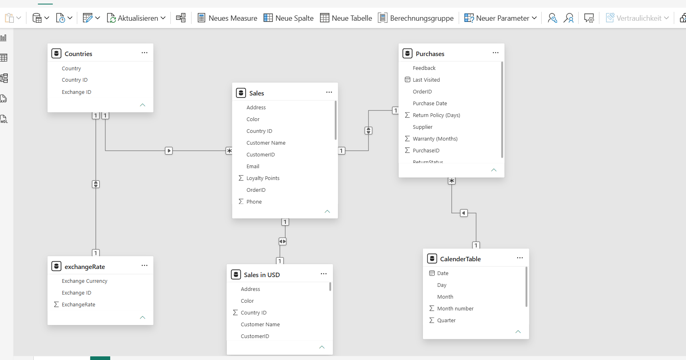
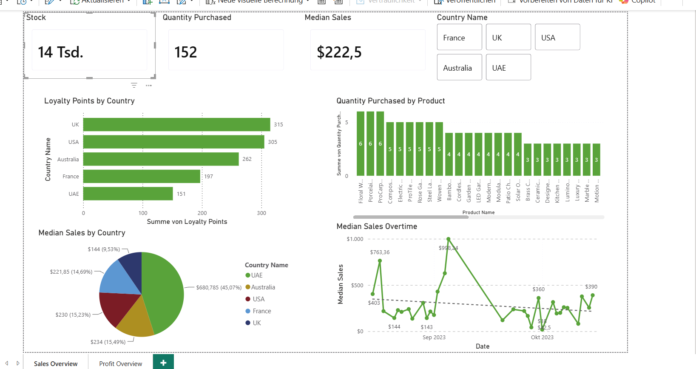
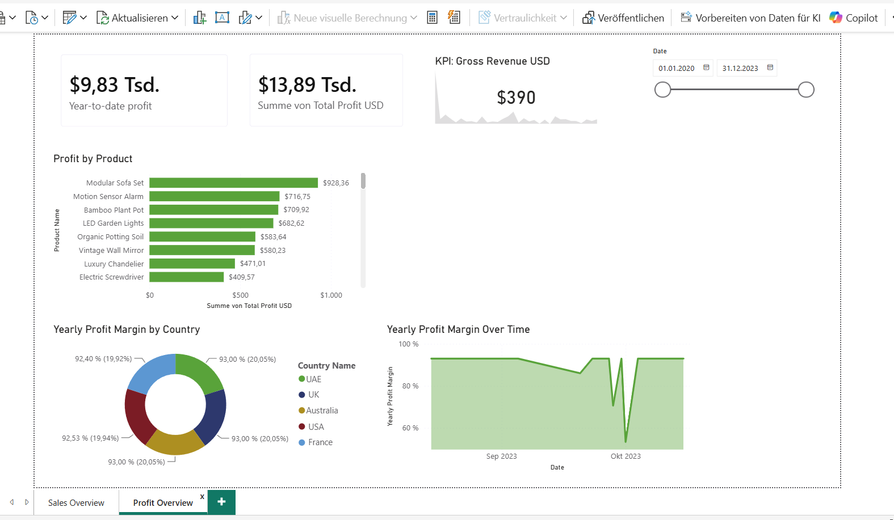

# Trailwind-Traders-Sales-Profit-Analytics-Dashboard
Interactive Power BI dashboard analyzing sales performance, profitability, customer loyalty, and product trends using DAX and Power Query.
## Project Overview
This project is a Power BI Business Intelligence solution developed using the Trailwind Traders dataset. The dashboard provides insights into sales performance, profitability, customer loyalty, and product trends through interactive visualizations and KPI tracking.
## Data Preparation & Modeling
- Imported and transformed multiple datasets using Power Query.
- Optimized data types and validated data quality.
- Created calculated revenue, cost, and total Profit fields.
- Integrated exchange-rate data using Python and Power BI.
- Designed a relational data model linking Sales, Purchases, Countries, Calendar, and Exchange tables.
- Configured one-to-one and many-to-one relationships to support accurate reporting.

## DAX Measures
- Developed custom measures for:
- Gross Revenue
- Profit Margin
- Year-to-Date (YTD) Profit
- Quarterly Profit
- Median Sales
- Total Profit
## Dashboard Development
- Built interactive Sales and Profit report.
- Added country and date slicers for dynamic filtering.
- Created KPI cards, trend analyses, product performance visualizations, and country-level profitability reports.
## Key Insight
- UK and USA customers exhibited the highest loyalty engagement, indicating strong customer retention in these markets.
- Profitability was driven primarily by a small group of high-performing products, led by the Modular Sofa Set and Motion Sensor Alarm.
- Profit margins remained consistently above 90% throughout most of the reporting period, demonstrating strong operational efficiency despite occasional fluctuations.
## Dashboard Overview

## Bike_Usage Analysis

## Autor
Ikechukwu Caleb Mgbemeneh
